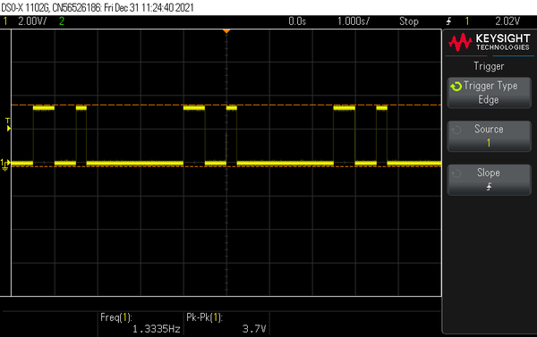
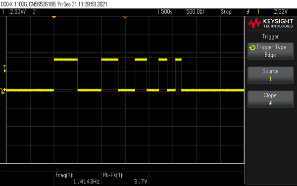
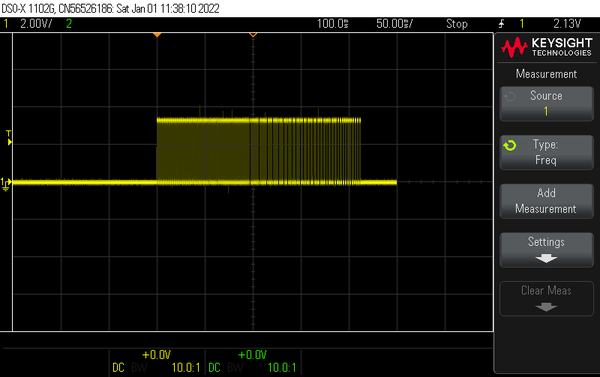
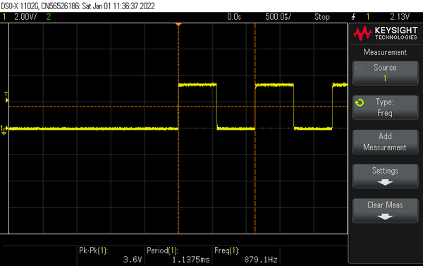
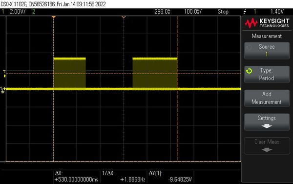

# Bird Call Simulator
My attempts to imitate different bird calls ended up in a highly parameterizable function that can also serve as a sweep generator for other experiments. I also discovered that a lambda expression is useful to make the code more concise.

The basic function for sound generation is to turn a buzzer on and off. For simplicity, the on time and the off time should be the same. If we pack this functionality into a lambda expression and call it buz, we get:
```
    auto buz = [](uint32_t usT0){
        digitalWrite(PIN_BUZZER, HIGH);
        delayMicroseconds(usT0);
        digitalWrite(PIN_BUZZER, LOW);
        delayMicroseconds(usT0);};
```
If we call this function n times, we get a tone consisting of n square waves of the period 2*T0 microseconds.
A bird call, however, is not a sound of a single frequency, but a periodic chirping with rising or falling frequencies.

So the chirp function I want to design surely needs the parameters "start frequency" and "end frequency". Additionally I want to be able to define in how many steps the end frequency should be reached. And as already mentioned, I can specify how many periods the tone of a single frequency should consist of.

I could do this by adding a small frequency difference at each step. However, it is easier to divide the frequency range into equal intervals, as in the chromatic scale, and multiply the frequency of successive notes by a constant factor. This also has the advantage that I don't have to worry about whether the initial frequency is greater or less than the final frequency. The multiplier to be calculated then simply becomes greater or less than 1.

A chirp function that sweeps a certain frequency range once in n steps could therefore look like this:
```
    chirp(fStart, fEnd, nSteps, nPeriods)
```
But wait, a bird chirps several times with small interruptions between each peep. So the function gets 2 more parameters, namely nChirps and msPause, which specify how many chirps should sound and in which time interval.

The whole conversion of frequencies into periods and the determination of the frequency multiplier are hidden in the function body and the "birdcall designer" can fully concentrate on the selection of the function parameters to imitate a specific bird.

After all these considerations, the chirp function finally looks like this:
```
void chirp(uint32_t fStart, uint32_t fStop, int nSteps, int nPeriods, int nChirps, uint32_t msPause = 50)
    {
        double pStart = 1000000.0 / (double)fStart;
        double pStop  = 1000000.0 / (double)fStop;

        // We calculate the multiplicator k to get fStop in nSteps
        // fStop   = fStart * k ^ nSteps
        // 1/pStop = 1/pStart * k ^ nSteps
        // pStart/pStop = k ^ nSteps
        // We use the periods, because that fits better to toggle the buzzer 

        double k = log(pStart / pStop) / (double)nSteps;  
        k = exp(-k);  // here we get actually 1/k, because we will multiply in the buzzer loop

        // lambda expression to toggle the buzzer once with duty cycle 50%  |¨¨|__|
        //                                                                   T0 T0
        auto buz = [](uint32_t usT0){
            digitalWrite(PIN_BUZZER, HIGH);
            delayMicroseconds(usT0);
            digitalWrite(PIN_BUZZER, LOW);
            delayMicroseconds(usT0);};

        for (int n = 0; n < nChirps; n++) // output nChirps
        { 
            uint32_t p = (uint32_t)round((double)pStart);

            for (int s = 0; s <= nSteps; s++)
            {
                for (int n = 0; n < nPeriods; n++) buz(p/2); // output nPulses with same pitch
                p *= k;
            }
            delay(msPause);
        }  
    }
```

## Let's take a look at some function calls:
```
    chirp(1, 1, 1, 1, 1, 2000)
```

Start and end frequency are each 1 Hz. The end frequency is reached in one step and the two frequencies each consist of one period and the chirp is executed once. At the end of this chirp there is a 2 sec. wait. But because I call the function repeatedly in the main loop of the program, the pulse train also appears repeatedly in the screenshot from my scope (see below).


## ---

```
    chirp(1, 2, 1, 1, 1, 2000)
```
Same as above, but the final frequency is 2 Hz.


## ---

```
    chirp(1, 4, 4, 1, 1, 2000)
```
The start frequency is 1 HZ, the end frequency is 4 Hz. This is reached in 4 steps and each intermediate frequency consists of 1 period and 1 chirp is executed. At the end also 2000 ms are waited.


## ---

```
    chirp(880, 440, 12, 10, 1, 2000);
```
Generates the 12 semitones of the chromatic scale starting at 880 Hz and ending at the concert pitch 440 Hz. Each tone consists of 10 periods. To hear the individual tones better, increase the number of periods from 10 to 1000. 

 

Chromatic chirp over one octave from 880 Hz to 440 Hz
## ---



Zoomed in at start of chromatic chirp, beginning with 880 Hz
## --- 


Zoomed in at end of chromatic chirp, ending with 440 Hz
## --- 

Let's combine several chirps to imitate different birds, e.g. the cuckoo.
```
    void cuckoo()
    {
    const float minorThird = 1.335;
    const float cuc = 739.989;          // F#5
    const float koo = cuc / minorThird; // C#5

    chirp(cuc, cuc, 1, 46, 1, 200);
    chirp(koo, koo, 1, 52, 1, 830);
    }
```


Start and end frequency of "cuc" as well as of "koo" are the same. Therefore, the two calls sound 2 * 46 * 1/740 = 124 ms and 2 * 52 * 1/554.3 = 188 ms long with a pause of 200 ms in between.

This does not sound very natural, because the real cuckoo does not call with square waves, but with almost pure sine tones.

## Program Code
There are 8 different "birds" implemented in the program, which are called to sing in random order. Maybe a reader programs an alarm clock which greets him in the morning with a bird concert.
