# Bird Call Simulator
My attempts to imitate different bird calls ended up in a highly parameterizable function that can also serve as a sweep generator for other experiments. I also discovered that a lambda expression is useful to make the code more concise.

The basic function for sound generation is to turn a buzzer on and off. For simplicity, the on time and the off time should be the same. If we pack this functionality into a lambda expression and call it buz, we get:
```
    // lambda expression to toggle a buzzer once 
    // with a duty cycle of 50% |¨¨¨|___|
    //                           T0  T0
    auto buz = [](uint32_t usT0){ 
        digitalWrite(PIN_BUZZER, HIGH);
        delayMicroseconds(usT0); 
        digitalWrite(PIN_BUZZER, LOW);
        delayMicroseconds(usT0);};
```
If we call this function n times, we get a tone consisting of n square waves of the period 2*T0 microseconds.
A bird call, however, is not a sound of a single frequency, but a periodic chirping with rising or falling frequencies.

So the chirp function I want to design surely needs the parameters "start frequency" and "end frequency". Additionally I want to be able to define in how many steps the end frequency should be reached. And as already mentioned, I can specify how many periods the tone of a single frequency should consist of.

I could do this by adding a small frequency difference at each step. However, it is also easy to divide the frequency range into equal intervals, as in the chromatic scale, and multiply the frequency of successive notes by a constant factor. 

A chirp function that sweeps a certain frequency range once in n steps could therefore look like this:
```
    chirp(fStart, fEnd, nSteps, nPeriods)
```
But wait, a bird chirps several times with small interruptions between each peep. So the function gets 2 more parameters, namely nChirps and msPause, which specify how many chirps should sound and in which time interval.

The whole conversion of frequencies into periods and the determination of the frequency multiplier are hidden in the function body and the "birdcall designer" can fully concentrate on the selection of the function parameters to imitate a specific bird.

After all these considerations I decided to make the duty cycle variable as well (1 .. 99%) and finally the chirp function looked like this:

## Exponential Chirp
Because successive frequencies are multiplied by a constant factor at each step, the frequencies increase exponentially.
```
void chirp(uint32_t fStart, uint32_t fStop, int nSteps, int nPeriods, int nChirps, int duty, uint32_t msPause)
{
    double pStart = 1000000.0 / (double)fStart;
    double pStop  = 1000000.0 / (double)fStop;
    // We calculate the multiplicator k to get fStop in nSteps
    // fStop = fStart * k ^ nSteps ---> 1/pStop = 1/pStart * k ^ nSteps ---> pStart/pStop = k ^ nSteps
    // But we use the periods, because that fits better to toggle the buzzer 
    double k = log(pStart / pStop) / (double)nSteps;  
    k = exp(-k);  // here we get actually 1/k, because we will multiply in the buzzer loop (see beloW) ❗

    // lambda expression to toggle a buzzer once 
    // with a duty cycle of duty% |¨¨¨|______|
    //                             tOn  tOff
    auto buz = [](uint32_t usTon, uint32_t usToff){  
        digitalWrite(PIN_BUZZER, HIGH);  
        delayMicroseconds(usTon);       
        digitalWrite(PIN_BUZZER, LOW); 
        delayMicroseconds(usToff);};

    for (int n = 0; n < nChirps; n++) // output nChirps
    { 
        uint32_t p = (uint32_t)round((double)pStart);

        for (int s = 0; s <= nSteps; s++)
        {
            uint32_t tOn  = period * duty / 100;
            uint32_t tOff = period - tOn;

            // output nPulses with same pitch
            for (int n = 0; n < nPeriods; n++) buz(tOn, tOff); 
            period *= k; // calculate next period ❗
        }
        delay(msPause);
    } 
}
```
The diagram below shows the generated frequencies with a chirp over 3 octaves from 440 Hz to 3520 Hz in 12 steps per octave.

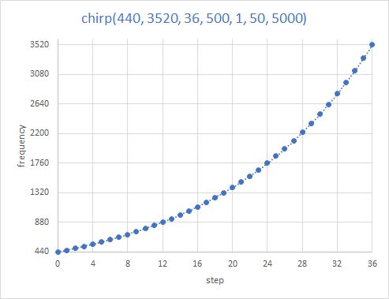

## Let's take a look at some function calls:
```
    chirp(1, 1, 1, 1, 1, 50, 2000)
```

Start and end frequency are each 1 Hz. The end frequency is reached in one step and the two frequencies each consist of one period and the chirp is executed once. The duty cycle is 50%. At the end of this chirp there is a 2 sec. wait. But because I call the function repeatedly in the main loop of the program, the pulse train also appears repeatedly in the screenshot from my scope (see below).

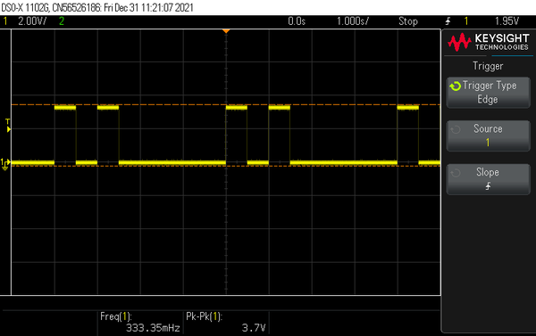
## ---

```
    chirp(1, 2, 1, 1, 1, 50, 2000)
```
Same as above, but the final frequency is 2 Hz.


## ---

```
    chirp(1, 4, 4, 1, 1, 50, 2000)
```
The start frequency is 1 HZ, the end frequency is 4 Hz. This is reached in 4 steps and each intermediate frequency consists of 1 period and 1 chirp is executed. At the end also 2000 ms are waited.


## ---

```
    chirp(880, 440, 12, 10, 1, 50, 2000);
```
Generates the 12 semitones of the chromatic scale starting at 880 Hz and ending at the concert pitch 440 Hz. Each tone consists of 10 periods. To hear the individual tones better, increase the number of periods from 10 to 1000. 

 

Chromatic chirp over one octave from 880 Hz to 440 Hz
## ---


Zoomed in at start of chromatic chirp, beginning with 880 Hz
## --- 

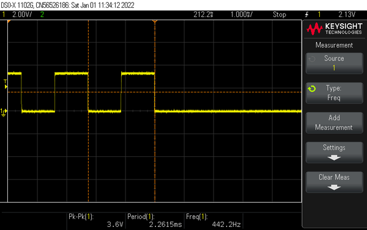

Zoomed in at end of chromatic chirp, ending with 440 Hz
## --- 

Let's combine several chirps to imitate different birds, e.g. the ***cuckoo***.
```
void cuckoo()
{
  const float third = 1.222;     // minorThird = 1.18 ... majorThird = 1.25
  const float cuc = 667;         //  E4
  const float koo = cuc / third; // ~C#4
  for (int i = 1; i < random(1,5); i++)
  {
    chirp(cuc, cuc, 1, 46, 1, linearScale, 50, 200);
    chirp(koo, koo, 1, 52, 1, linearScale, 50, 830);
  }
}
```


Start and end frequency of "cuc" as well as of "koo" are the same. Therefore, the two calls sound 2 * 46 * 1000/667 = 138 ms and 2 * 52 * 1000/546 = 190 ms long with a pause of 200 ms in between, summing up to a total of ~530ms as we can see in the oscillogram.

The artificial cuckoo does not sound very real, because the feathered cuckoo calls not with rectangular but with almost pure sine tones.

The cawing of a ***raven*** comes quite close to the real call if we reduce the duty cycle to 20% and call the function like this:
```
void raven()
{
  chirp(75,65,8,4,random(2, 6), 20, 350);
}
```

## Sinusoidal Chirp
Why would a bird change the frequencies of its beeps only exponentially? Interesting effects can be created if the frequencies of a chirp are changed sinusoidally. 

We map the step interval (0 .. nSteps) to the range (0 .. 2Pi), so we run through this range in nSteps steps. For each step we now calculate the corresponding frequency in the following way: 
```
    f = fm + fa * sin(k * s + phase)
    with
    fm = (fStart + fStop) / 2    The "middle" frequency
    fa = (fStop - fStart) / 2    The "frequency swing (amplitude)" around fm 
    k  = TWO_PI / nSteps;
    s  = step number, 0 .. nSteps
    phase = 0 or Pi/2    Phase shift to allow falling or rising chirps
```
The function looks like this:
```
void chirp_sinus(uint32_t fStart, uint32_t fStop, int nSteps, int nPeriods, bool phaseShifted, int nChirps, int duty, uint32_t msPause)
{
  double fm = (double)(fStart + fStop) / 2.0;          // arithmetic mean  
  double fa = ((double)fStop - (double)fStart) / 2.0;  // max. frequency swing around fm
  double k = TWO_PI / nSteps;
  double phase = phaseShifted ? HALF_PI : 0.0;

    auto buz = [](uint32_t usTon, uint32_t usToff){
        digitalWrite(PIN_BUZZER, HIGH);
        delayMicroseconds(usTon);
        digitalWrite(PIN_BUZZER, LOW);
        delayMicroseconds(usToff);};

  for (int n = 0; n < nChirps; n++) // output nChirps
  {
    for (int s = 0; s <= nSteps; s++)
    {
      double f = fm + fa * sin(k * s + phase); // get next frequency
      double p = 1000000.0 / f;
      uint32_t tOn  = p * duty / 100.0;
      uint32_t tOff = p - tOn;

      for (int n = 0; n < nPeriods; n++) buz(tOn, tOff);
    }
    delay(msPause);
  }
}
```

---

If we choose only a few steps to go through the frequency range, we will hear the individual tones well. For example:
```
chirp_sinus(440, 1320, 6, 500, false, 1, 50, 5000);  // without phase shift
```
runs through the frequencies 880, 1261,1261, 880, 499, 499, 880 

or

```
chirp_sinus(440, 1320, 6, 500, true, 1, 50, 5000);  // with phase shift
```
runs through the frequencies 1320, 1100, 660, 440, 660, 1100, 1320

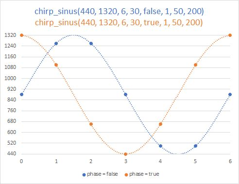

---

If we swap the start and stop frequencies, we get the following sound sequences:
```
chirp_sinus(1320, 440, 6, 500, false, 1, 50, 5000);  // without phase shift
```
runs through the frequencies 880, 499,499, 880, 1261, 1261, 880 

or

```
chirp_sinus(1320, 440, 6, 500, true, 1, 50, 5000);  // with phase shift
```
runs through the frequencies 440, 660, 1100, 1320, 1100, 660, 440

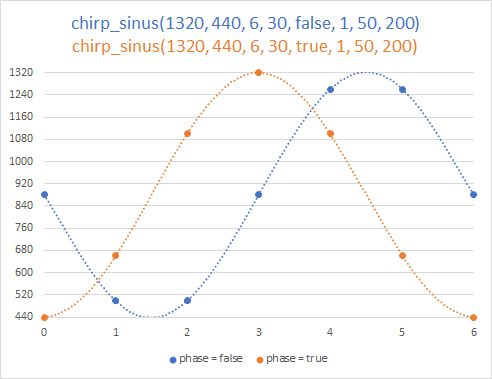

---
## Phaser
We can also keep the frequency constant and only change the duty cycle of the square wave. This changes the timbre of the tone. A corresponding function looks like this:
```
void phaser(uint32_t freq, int nPeriods, int dutyStart, int dutyEnd, int nChirps, uint32_t msPause)
{
  uint32_t p = 1000000/freq;

  auto buz = [](uint32_t usTon, uint32_t usToff){
      digitalWrite(PIN_BUZZER, HIGH);
      delayMicroseconds(usTon);
      digitalWrite(PIN_BUZZER, LOW);
      delayMicroseconds(usToff);};
  for (int n = 0; n < nChirps; n++) // output nChirps
  {
    for (int d = dutyStart; d <= dutyEnd; d++)
    {
        uint32_t tOn  = p * d / 100;
        uint32_t tOff = p - tOn;
        for (int n = 0; n < nPeriods; n++) buz(tOn, tOff);
    }
    delay(msPause); 
  }    
}
```
---
## Generalized Chirp
I was about to finish the  *birdsong* project when I took another look at the various chirp functions. Actually they all do the same, they only differ in how the chirp frequencies are generated. It must be possible to add another parameter "frequency generator" to the basic function and to program only different **frequency generators**. So let's define a type for the frequency generator function:
```
typedef double (*FreqGen)(int stepNbr, double fStart, double fStop, int nSteps);
```
The generalized chirp function now looks like this:
```
void chirp(double fStart, double fStop, int nSteps, int nPeriods, int nChirps, FreqGen fgen, int duty, uint32_t msPause)
{
    auto buz = [](uint32_t usTon, uint32_t usToff){
      digitalWrite(PIN_BUZZER, HIGH);
      delayMicroseconds(usTon);
      digitalWrite(PIN_BUZZER, LOW);
      delayMicroseconds(usToff);};

  for (int n = 0; n < nChirps; n++) // output nChirps
  {
    for (int s = 0; s <= nSteps; s++)
    {
      double fNext = fgen(s, fStart, fStop, nSteps);  //🔴 calling the frequency generator

      double p = 1000000.0 / fNext;      // calculate the period
      uint32_t tOn  = p * duty / 100.0;  // calculate on and off time
      uint32_t tOff = p - tOn;
      //log_i("%2d: f = %5.2f, ton = %d, toff = %d", s, fNext, tOn, tOff);
      for (int n = 0; n < nPeriods; n++) buz(tOn, tOff);
    }
    delay(msPause);
  }
}
```
Now we only have to program the generators for exponential and sinusoidal frequency change. We remove the phase shift by Pi/2 introduced in the function chirp_sinus and code a cosine generator instead, which gives the same result.

### Generator for exponentially (chromatically) varying frequencies
```
double chromaticScale(int stepNbr, double fStart, double fStop,int nSteps)
{
    // We calculate the multiplicator k to get fStop in nSteps
    // fStop = fStart * k ^ nSteps
    double k = log(fStop / fStart) / (double)nSteps;  
    double fNext = fStart * exp(k * stepNbr);
    return fNext;
}
```
### 2 Generators for frequencies following a sine
The range of steps 0 .. nSteps is mapped to 0 .. Pi or to 0 .. 2Pi
```
double sinePiScale(int stepNbr, double fStart, double fStop,int nSteps)
{
  double fa = (fStop - fStart);  // max. frequency swing
  const double k = PI / nSteps;
  double fNext = fStart + fa * sin(k * stepNbr); // get next frequency
  return fNext;
}
```
```
double sine2PiScale(int stepNbr, double fStart, double fStop,int nSteps)
{
  double fm = (fStart + fStop) / 2.0;  // arithmetic mean
  double fa = (fStop - fStart) / 2.0;  // max. frequency swing around fm
  const double k = TWO_PI / nSteps;
  double fNext = fm + fa * sin(k * stepNbr); // get next frequency
  return fNext;
}
```

### 2 Generators for frequencies following a cosine
The range of steps 0 .. nSteps is mapped to 0 .. Pi or to 0 .. 2Pi
```
double cosinePiScale(int stepNbr, double fStart, double fStop,int nSteps)
{
  double fm = (fStart + fStop) / 2.0;  // arithmetic mean
  double fa = (fStop - fStart) / 2.0;  // max. frequency swing around fm
  const double k = PI / nSteps;
  double fNext = fm - fa * cos(k * stepNbr); // get next frequency
  return fNext;
}
```
```
double cosin2PiScale(int stepNbr, double fStart, double fStop,int nSteps)
{
  double fm = (fStart + fStop) / 2.0;  // arithmetic mean
  double fa = (fStop - fStart) / 2.0;  // max. frequency swing around fm
  const double k = TWO_PI / nSteps;
  double fNext = fm + fa * cos(k * stepNbr); // get next frequency
  return fNext;
}
```

And here is a linear generator
### Generator for linearly varying frequencies
```
double linearScale(int stepNbr, double fStart, double fStop,int nSteps)
{
  double k = (fStop - fStart) / nSteps;
  double fNext = fStart + k * stepNbr;
  return fNext;
}
```
The generated frequencies are decreasing because the start frequency is greater than the stop frequency.

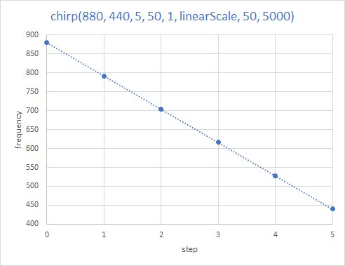

---

### 2 Generator for frequencies following an arctan
The range of steps 0 .. nSteps is mapped to 0 .. Pi or to 0 .. 2Pi

```
double atanPiScale(int stepNbr, double fStart, double fStop,int nSteps)
{
  double k = (fStop - fStart)/atan(PI);
  double fNext = fStart + k * atan(PI/nSteps * stepNbr);
  return fNext;
}
```
```
double atan2PiScale(int stepNbr, double fStart, double fStop,int nSteps)
{
  double k = (fStop - fStart)/atan(TWO_PI);
  double fNext = fStart + k * atan(TWO_PI/nSteps * stepNbr);
  return fNext;
}
```
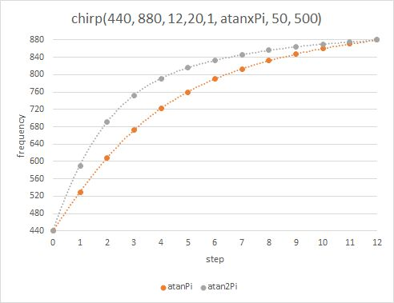

---

## Summary
We have implemented a universal chirp function that can generate frequencies that follow a mathemathical rule.
For comparison, we call all generators and plot the generated frequencies all together in one diagram. The frequency range is swept in 5 steps.

The first diagram shows the frequencies when fStart is smaller than fStop so that all chirps start with increasing frequencies. 

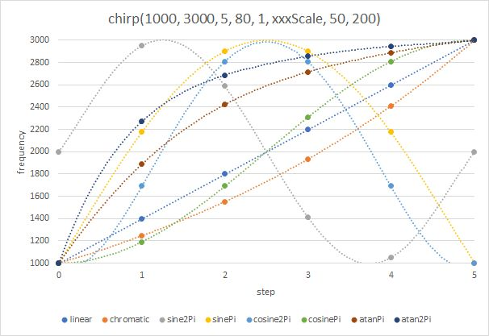

---

The second diagram shows the frequencies when fStart and fStop are swapped so that all chirps start with decreasing frequencies.

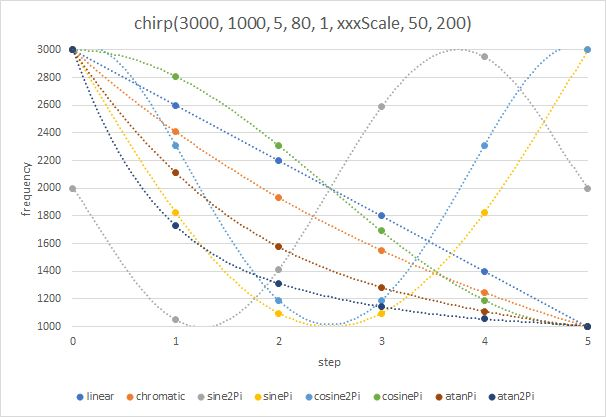

---

### Addendum 1
I had always been fascinated by the function sinc(x) = sin(x)/x with its increasing and decreasing waveform. How does an artificial bird sound whose beep starts with an increasing vibrato, changes into a sharp beep and fades out with a decreasing vibrato? But remember, it's not the volume, it's the pitch. 

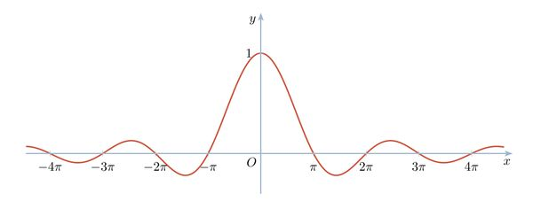

To which number range should I map my number of frequency steps? -5&pi;..+5&pi; or -3&pi;..+3&pi; maybe also 0..7&pi; or -4&pi;..0? Obviously, I need another parameter in my generator function to specify the multiples of &pi;. 


### 👉 A generator spanning -n&pi;..+n&pi;

```
  double sincScaleNpi_Npi(int stepNbr, double fStart, double fStop,int nSteps, int nPi)
  {
    double halfRange = nPi * PI;
    double range = 2 * halfRange;

    auto sinc = [](double x)
    {
      return fabs(x) < 0.001 ? 1.0 : sin(x)/x;
    };

    double fa = (fStop - fStart);  // max. frequency swing
    double k = range / nSteps;
    // get next frequency
    double fNext = fStart + fa * sinc(k * stepNbr - halfRange);
    return fNext;
  }
```

Chirps spanning the range -3&pi;..+3&pi; and -5&pi;..+5&pi; with fStart &lt; fStop

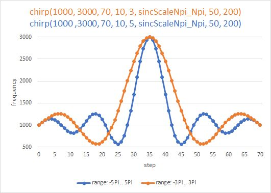

Chirps spanning the range -3&pi;..+3&pi; and -5&pi;..+5&pi; with fStart &gt; fStop

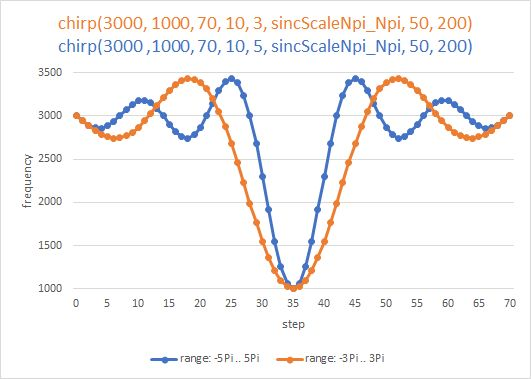

### 👉 A generator spanning -n&pi;..0;

``` 
double sincScaleNpi_0(int stepNbr, double fStart, double fStop,int nSteps, int nPi)
{
  double range = nPi * PI;

  auto sinc = [](double x)
  {
    return fabs(x) < 0.001 ? 1.0 : sin(x)/x;
  };

  double fa = (fStop - fStart);  // max. frequency swing
  double k = range / nSteps;
  // get next frequency
  double fNext = fStart + fa * sinc(k * stepNbr - range); 
  return fNext;
}
```

Chirps spanning the range -3&pi;..0; and -5&pi;..0; with fStart &lt; fStop

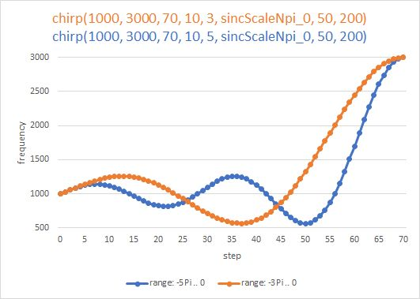

Chirps spanning the range -3&pi;..0 and -5&pi;..0 with fStart &gt; fStop

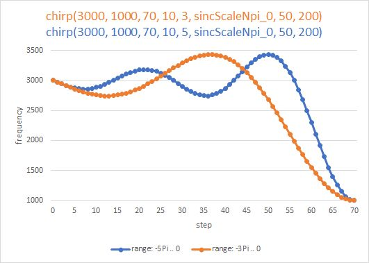

### 👉 A generator spanning the range 0..+n&pi;

```
double sincScale0_Npi(int stepNbr, double fStart, double fStop, int nSteps, int nPi)
{
  double range = nPi * PI;

  auto sinc = [](double x)
  {
    return fabs(x) < 0.001 ? 1.0 : sin(x)/x;
  };
  double swap = fStart; fStart = fStop; fStop = swap;

  double fa = (fStop - fStart);  // max. frequency swing
  double k = range / nSteps;
  double fNext = fStart + fa * sinc(k * stepNbr); // get next frequency
  //printf("%2d  %0.2f\n", stepNbr, fNext);
  return fNext;
}
```
Chirps spanning the range 0..+3&pi; and 0..+5&pi; with fStart &lt; fStop

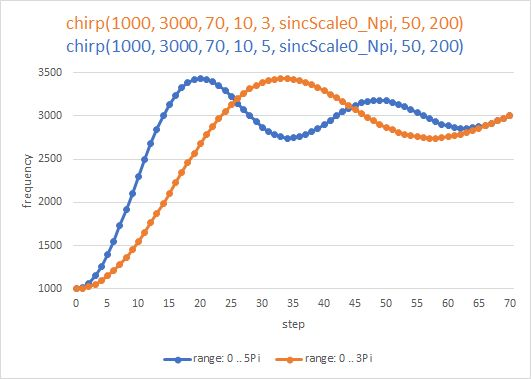

Chirps spanning the range 0..+3&pi; and 0..+5&pi; with fStart &gt; fStop

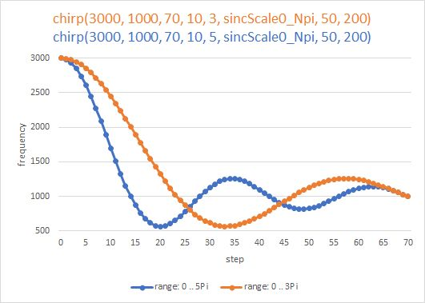

---

### Addendum 2
The presented chirps change the frequency according to mathematical laws. But how does the sound change if the frequency remains the same and only the duty cycle of the square wave changes? Let's try it and write a new function: 

### 👉 A Phaser
```
void phaser(uint32_t freq, int nPeriods, 
            int dutyStart, int dutyEnd, int nChirps, uint32_t msPause)
{
  uint32_t p = 1000000/freq;

  auto buz = [](uint32_t usTon, uint32_t usToff){
    digitalWrite(PIN_BUZZER, HIGH);
    delayMicroseconds(usTon);
    digitalWrite(PIN_BUZZER, LOW);
    delayMicroseconds(usToff);};

  for (int n = 0; n < nChirps; n++) // output nChirps
  {
    for (int d = dutyStart; d <= dutyEnd; d++)
    {
      uint32_t tOn  = p * d / 100;
      uint32_t tOff = p - tOn;
      for (int n = 0; n < nPeriods; n++) buz(tOn, tOff);
    } 
    delay(msPause);
  }    
}	
```
If we call the function with <code>phaser(500, 20, 1, 99, 1, 2000)</code> , we hear a tone of 500 Hz whose duty cycle is changed from 1 ... 99 %. Each of the 99 tones consists of 20 periods. If we listen carefully, we notice how the timbre of the selected frequency and also the volume changes. This is due to the fact that as the duty cycle changes, the composition of the harmonic frequencies of the sound changes. 

## Program Code
With all this knowledge, I implemented various "birds" in the program that are called to sing in random order. Now I wanted to let the birds whistle in another program. Soon I realized that my few lines of code would get lost in the extensive code of the sound generation. Therefore I put this part into a universal class ***Chirpmaker***. Now the application of the sound functions was reduced to a few lines: 
```
#include "Chirpmaker.h"

const uint8_t PIN_BUZZER = GPIO_NUM_4;
Chirpmaker cm(PIN_BUZZER); // Creates an object that emits sounds at pin 4

void setup()
{
  // Your initialization code
  cm.signet();  // Call a signet to signal the end of setup
}

void loop() 
{
  cm.phoneCall(7);
  cm.birdConcert(3000);
  cm.chirp(1000, 3000, 70, 100, 5, sincScaleNpi_Npi, 50, 500);
}
```

Maybe a reader programs an alarm clock which greets him in the morning with a bird concert.
